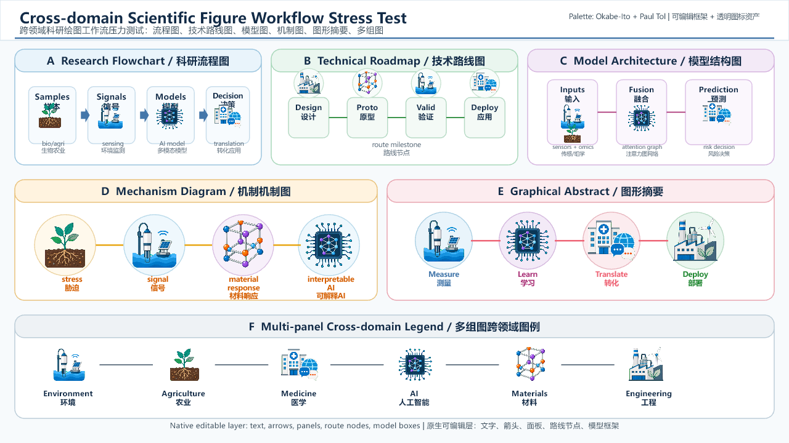

# scientific-figure

> A Codex skill for turning scientific figure prompts or existing PNG/JPG diagrams into editable PPTX/SVG figure packages, with Image2 visual masters, transparent assets, manifests, and QA notes.

[](LICENSE)


**Languages:** [English](#english) | [中文](#中文)



---

## English

`scientific-figure` packages a publication-aware scientific drawing workflow as a reusable Codex skill. It is designed for workflow diagrams, technical route maps, model architecture figures, mechanism diagrams, graphical abstracts, and multi-panel research figures.

The core workflow stays intentionally strict:

```text
Image2 visual master -> reference-guided single assets -> transparent assets -> editable PPTX/SVG rebuild -> QA package
```

Image2 is used for visual exploration, master composition, and complex asset generation. The final deliverables are rebuilt with editable Presentation/SVG objects wherever practical. Text, arrows, boxes, connectors, panels, and labels are editable; complex scientific mini-illustrations are transparent image assets by default.

After a master or source image is selected, the workflow switches into a **Reference-Guided Asset Factory**: every meaningful complex visual element, semantic symbol, and directional route symbol must be inventoried, regenerated as its own similar no-text asset when needed, background-removed, and placed back at the master/source bbox. The master/source is a layout and style contract, not a crop sheet, and a simplified same-topic redraw must fail QA.

### ✨ Highlights

| Feature | What it means |
| --- | --- |
| Prompt-to-figure | Start from a research prompt and generate a complete figure package. |
| Image-to-editable | Start from an existing PNG/JPG/screenshot and rebuild it as editable PPTX/SVG. |
| Preflight hook | Codex asks for mode, purpose, palette, output root, target standard, and editability boundaries before drawing. |
| Editable framework | Text, arrows, panels, boxes, connectors, and layout structure are rebuilt as editable objects. |
| Transparent assets | Complex icons are generated separately as no-text assets, background-removed, and placed back into the editable figure. |
| Reference-guided assets | Complex assets are generated one semantic item at a time to match the selected master/source role, angle, style, and placement. |
| Semantic and route coverage | Warning marks, result icons, vapor arrows, moisture bundles, curved cascade routes, and gradient transition arrows must be mapped or explicitly justified. |
| Honest vector policy | SVG wrappers are not treated as true path vectors; real vectorized candidates are tracked separately. |
| Truthful QA gates | Fine-region, semantic-symbol, directional-route, no-coarse-asset, master-similarity, and no-crop gates must fail honestly when the preview diverges. |

### 🚀 Quick Start

Clone the repository:

```powershell
git clone https://github.com/Yuhang-Xiao/scientific-figure.git
cd scientific-figure
```

Install the skill into your user-level Codex skills directory:

```powershell
Copy-Item -Recurse .\skill\scientific-figure-workflow "$env:USERPROFILE\.codex\skills\scientific-figure-workflow" -Force
```

Restart Codex if the skill list does not refresh automatically.

Then call the skill in Codex:

```text
Use $scientific-figure-workflow to create an editable top-journal-style workflow figure for multimodal food-safety risk prediction. Use bilingual labels and export PPTX, SVG, preview PNG, original master, and transparent icon assets.
```

### 🧭 Two Workflows

#### Mode A: Prompt-to-Figure

Use this mode when you have a topic, model, mechanism, route map, or graphical abstract idea, but no existing figure file.

```text
Use $scientific-figure-workflow to draw a top-journal-style technical route map for AI-assisted cancer biomarker discovery. Use English and Chinese short labels. Export PPTX, SVG, preview PNG, the Image2 master, and transparent icon assets.
```

Typical flow:

```text
Drawing prompt
  -> Image2 visual master
  -> fine-region inventory
  -> reference-guided single icon/mini-illustration assets
  -> transparent cutouts
  -> editable PPTX/SVG reconstruction
  -> manifests and QA
```

#### Mode B: Image-to-Editable

Use this mode when you already have a PNG/JPG/screenshot/reference diagram and want an editable version.

```text
Use $scientific-figure-workflow to convert D:\path\figure.png into an editable flowchart. Recreate matching no-text icons as transparent assets, then export PPTX and SVG.
```

Typical flow:

```text
Source image
  -> content and layout understanding
  -> fine-region inventory
  -> reference-guided single generated matching assets
  -> transparent cutouts
  -> editable framework reconstruction
  -> manifests and QA
```

The source image is used for understanding and alignment, not as the final flattened background or as a source for cut-out assets.

### 🪝 Preflight Hook

Before any drawing or rebuilding starts, the skill should ask or confirm:

- **Mode:** prompt-to-figure or image-to-editable
- **Purpose:** journal submission, presentation, grant/proposal, manuscript draft, or internal concept
- **Figure type:** flowchart, technical roadmap, model architecture, mechanism diagram, multi-panel figure, or graphical abstract
- **Tone and palette:** Okabe-Ito/Wong, Paul Tol, Viridis/Cividis, ColorBrewer, Minimal Journal, or custom
- **Target standard:** target journal/publisher when known, otherwise a Nature-like default
- **Editability boundary:** editable framework plus transparent image assets by default
- **Output root and figure slug**
- **Extra requirements:** language, aspect ratio, panel count, icon editability, source constraints, and forbidden elements

The choices are recorded in:

```text
00_request/preflight_choices.json
```

### 🎨 Palette Defaults

The skill includes several research-friendly palette families:

- **Okabe-Ito/Wong:** color-blind-friendly categorical palette
- **Paul Tol Bright:** clean categorical colors for papers and slides
- **Viridis/Cividis:** perceptually uniform scientific color maps
- **ColorBrewer Set2:** soft categorical colors for schematic diagrams
- **Minimal Journal:** white background, dark gray text, and one restrained accent color

Details live in [docs/palettes.md](docs/palettes.md).

### 📦 Output Package

Each run creates a standalone package named like:

```text
<figure_slug>_<YYYYMMDD_HHMM>/
```

Start here when reviewing results:

```text
09_manifests/output_index.json
08_previews/preview_pptx.png
06_editable_pptx/<figure_slug>.pptx
07_svg_export/<figure_slug>.svg
10_qa/QA_notes.md
```

Full package layout:

```text
00_request/           original request, preflight choices, mode
01_inputs/            user source images, assets, notes
02_image2_master/     Image2 master images and selected/rejected versions
03_assets_raw/        raw single generated no-text assets
04_assets_cutout/     transparent PNG/WebP assets and alpha QA
05_assets_vector/     SVG wrappers, vectorized candidates, comparisons
06_editable_pptx/     final editable PPTX and PPTX validation
07_svg_export/        final SVG export and render notes
08_previews/          preview PNGs, contact sheets, visual comparisons
09_manifests/         machine-readable output, asset, and editability indexes
10_qa/                human QA, policy checks, known issues
_archive/             intermediate builds and discarded versions
```

See [docs/output-structure.md](docs/output-structure.md) for the full contract.

### 📚 Documentation

| Topic | Link |
| --- | --- |
| How to use the skill | [docs/usage.md](docs/usage.md) |
| Output package contract | [docs/output-structure.md](docs/output-structure.md) |
| Debug and QA rules | [docs/debug-and-qa.md](docs/debug-and-qa.md) |
| Existing image conversion | [docs/image-to-editable.md](docs/image-to-editable.md) |
| Vectorization strategy | [docs/vectorization.md](docs/vectorization.md) |
| Journal-style figure standards | [docs/journal-standards.md](docs/journal-standards.md) |
| AI image and submission policy notes | [docs/ai-policy.md](docs/ai-policy.md) |
| Palette options | [docs/palettes.md](docs/palettes.md) |
| Editability boundaries | [docs/editability-boundaries.md](docs/editability-boundaries.md) |

### 🧪 Example

The lightweight example in [examples/lightweight](examples/lightweight) includes:

- a preview image
- an output index
- an asset manifest
- an editability manifest
- QA notes

The Amazon regression example in [examples/amazon_regression_v2](examples/amazon_regression_v2) records the v2 Reference-Guided Asset Factory test for an Image2-to-editable mechanism figure. It includes the side-by-side master comparison, key manifests, QA notes, and a reproducible builder script, while omitting heavy generated deliverables.

Large generated masters, complete PPTX/SVG deliverables, raw Image2 caches, transparent asset folders, and intermediate builds are intentionally excluded from the public example.

### ✅ Validation

Validate the repository skill copy:

```powershell
python -X utf8 C:\Users\Administrator\.codex\skills\.system\skill-creator\scripts\quick_validate.py .\skill\scientific-figure-workflow
```

Validate the installed user-level skill:

```powershell
python -X utf8 C:\Users\Administrator\.codex\skills\.system\skill-creator\scripts\quick_validate.py C:\Users\Administrator\.codex\skills\scientific-figure-workflow
```

The public example is lightweight by design, so these checks validate skill structure and metadata rather than full Image2/Presentation runtime output.

### ⚠️ Limitations

- Transparent PNG/WebP assets can be moved, scaled, masked, and replaced, but their internal paths are not editable.
- An SVG wrapper around a PNG/WebP asset is a scalable container, not a true editable path-vector icon.
- Automatic vectorization is only appropriate for simple flat icons; complex scientific illustrations should usually remain transparent assets.
- A few broad generated assets are not enough when the master/source contains independently meaningful clouds, routes, maps, legends, state tiles, warning icons, or result-card icons.
- If `comparison_master_vs_editable.png` is visibly a same-topic redesign instead of a master-aligned rebuild, the package is not acceptable and the QA gates must be marked failed.
- Image2 may generate unwanted text, pseudo-text, or imperfect chroma-key backgrounds. These issues must be fixed, replaced, or recorded in QA.
- For real journal submission, always check the target journal or publisher policy before using AI-generated image assets in final artwork.

### 🤝 Contributing

Contributions are welcome when they preserve the core workflow and keep output traceable:

```text
Image2 visual master -> reference-guided single assets -> transparent assets -> editable PPTX/SVG rebuild -> QA package
```

Please read [CONTRIBUTING.md](CONTRIBUTING.md) before opening changes.

### 📄 License

MIT. See [LICENSE](LICENSE).

---

## 中文

`scientific-figure` 是一个面向 Codex 的科研绘图工作流 skill。它用于把“绘图 prompt”或“已有 PNG/JPG 流程图、截图、参考图”转换成结构清晰、可复查、可继续修改的科研图工作包，适合流程图、技术路线图、模型结构图、机制图、graphical abstract 和多 panel figure。

它的核心流程保持不变：

```text
Image2 视觉母版 -> 参考母版逐元素资产 -> 透明资产 -> 可编辑 PPTX/SVG 重建 -> QA 工作包
```

Image2 负责探索视觉风格、生成母版和复杂小图标资产；最终交付图由 Presentation/SVG 重新搭建。文字、箭头、面板、连接线、节点、标签等结构元素尽量保持可编辑；复杂科研小插图默认作为透明背景图片资产使用，不强行转成难看或失真的矢量路径。

母版或源图一旦确定，workflow 必须进入 **Reference-Guided Asset Factory**：复杂视觉元素、语义小图标和方向路线图形都要逐项盘点；需要图像资产时，基于母版相似生成无文字单元素资产，再做透明背景处理并按母版 bbox 放回。母版/源图只作为布局和风格合同，不作为裁切素材。

### ✨ 核心亮点

| 功能 | 含义 |
| --- | --- |
| Prompt-to-Figure | 直接从科研主题或绘图需求生成完整工作包。 |
| Image-to-Editable | 从已有 PNG/JPG/截图理解内容，再重建为可编辑 PPTX/SVG。 |
| 绘图前 Hook | 在真正制图前确认模式、用途、配色、输出目录、目标标准和可编辑边界。 |
| 框架可编辑 | 文字、箭头、面板、框、连接线和整体布局用 PPTX/SVG 原生对象重建。 |
| 图标透明资产 | 复杂图标单独生成无文字资产，抠成透明背景后放回最终图。 |
| 语义符号与方向路线覆盖 | 警告符、结果卡片图标、蒸散发箭头、水汽箭头束、弧形级联路线和渐变转变箭头必须被识别、生成或明确例外。 |
| 矢量边界清楚 | SVG wrapper 不冒充真正路径矢量；自动矢量化候选会单独记录。 |
| QA 优先 | 每次输出都会记录资产来源、可编辑性、方向路线覆盖、母版相似度、已知问题和投稿政策风险。 |

### 🚀 快速开始

克隆项目：

```powershell
git clone https://github.com/Yuhang-Xiao/scientific-figure.git
cd scientific-figure
```

把 skill 安装到 Codex 用户级 skills 目录：

```powershell
Copy-Item -Recurse .\skill\scientific-figure-workflow "$env:USERPROFILE\.codex\skills\scientific-figure-workflow" -Force
```

如果 Codex 没有自动刷新 skill 列表，请重启 Codex。

随后可以这样调用：

```text
用 $scientific-figure-workflow 画一个食品安全风险预测技术路线图，顶刊风格，中英文标签，输出 PPTX、SVG、预览图、原图和透明图标。
```

### 🧭 两种使用模式

#### Mode A：Prompt-to-Figure

适合你只有科研主题、技术路线、机制图想法、模型结构想法或 graphical abstract 需求，还没有现成图片的情况。

```text
用 $scientific-figure-workflow 画一个 AI 辅助癌症生物标志物发现技术路线图，Nature-like 风格，中英文短标签，输出可编辑 PPTX 和 SVG。
```

典型流程：

```text
绘图需求
  -> Image2 视觉母版
  -> 单独图标/小插图资产
  -> 透明抠图
  -> 可编辑 PPTX/SVG 重建
  -> manifest 和 QA
```

#### Mode B：Image-to-Editable

适合你已有 PNG/JPG 流程图、截图或参考图，希望转换成可修改版本的情况。

```text
用 $scientific-figure-workflow 把 D:\path\figure.png 转成可编辑流程图，重新生成匹配的无文字图标并抠透明，输出 PPTX 和 SVG。
```

典型流程：

```text
已有图片
  -> 理解内容和布局
  -> 单独生成匹配图标
  -> 透明抠图
  -> 可编辑框架重建
  -> manifest 和 QA
```

已有图片用于理解和对齐，不应作为最终图的整张扁平背景。

### 🪝 绘图前 Hook

真正绘图或重建之前，skill 会先询问或确认：

- **启动方式：** 直接 prompt 画图，还是已有图片转可编辑图
- **用途：** 真投稿、PPT 汇报、基金/项目申请、论文草图或内部概念图
- **图类型：** 流程图、技术路线图、模型结构图、机制图、多 panel figure 或 graphical abstract
- **色调/配色：** Okabe-Ito/Wong、Paul Tol、Viridis/Cividis、ColorBrewer、Minimal Journal 或自定义
- **目标标准：** 具体期刊/出版社，或默认 Nature-like 科研图标准
- **可编辑边界：** 默认框架文字箭头可编辑，复杂小图标作为透明图片资产
- **输出根目录和图名 slug**
- **其他要求：** 语言、比例、panel 数量、是否尝试图标矢量化、数据来源限制和禁用元素

这些选择会记录在：

```text
00_request/preflight_choices.json
```

### 🎨 内置配色

skill 内置几类适合科研图的配色：

- **Okabe-Ito/Wong：** 色盲友好的分类配色
- **Paul Tol Bright：** 适合论文和汇报的清晰分类配色
- **Viridis/Cividis：** 感知均匀的科学色图
- **ColorBrewer Set2：** 柔和的示意图分类配色
- **Minimal Journal：** 白底、深灰文字、单一强调色

详见 [docs/palettes.md](docs/palettes.md)。

### 📦 输出目录

每次绘图都会生成一个独立工作包：

```text
<figure_slug>_<YYYYMMDD_HHMM>/
```

查看结果时优先打开：

```text
09_manifests/output_index.json
08_previews/preview_pptx.png
06_editable_pptx/<figure_slug>.pptx
07_svg_export/<figure_slug>.svg
10_qa/QA_notes.md
```

完整目录结构：

```text
00_request/           原始需求、preflight 选择、模式记录
01_inputs/            用户输入图片、已有资产、笔记
02_image2_master/     Image2 母版、入选版本、失败或有问题版本
03_assets_raw/        原始单元素生成资产
04_assets_cutout/     透明 PNG/WebP 资产和 alpha 检查
05_assets_vector/     SVG wrapper、自动矢量化候选、对比记录
06_editable_pptx/     最终可编辑 PPTX 和 PPTX 校验
07_svg_export/        最终 SVG 和渲染记录
08_previews/          预览图、contact sheet、母版对比图
09_manifests/         输出索引、资产索引、可编辑性索引
10_qa/                人工 QA、投稿政策检查、已知问题
_archive/             中间构建和丢弃版本
```

完整规范见 [docs/output-structure.md](docs/output-structure.md)。

### 📚 文档入口

| 主题 | 链接 |
| --- | --- |
| 使用方法 | [docs/usage.md](docs/usage.md) |
| 输出目录结构 | [docs/output-structure.md](docs/output-structure.md) |
| Debug 和 QA | [docs/debug-and-qa.md](docs/debug-and-qa.md) |
| 已有图片转可编辑图 | [docs/image-to-editable.md](docs/image-to-editable.md) |
| 矢量化策略 | [docs/vectorization.md](docs/vectorization.md) |
| 期刊图标准 | [docs/journal-standards.md](docs/journal-standards.md) |
| AI 图像与投稿政策 | [docs/ai-policy.md](docs/ai-policy.md) |
| 科研配色 | [docs/palettes.md](docs/palettes.md) |
| 可编辑边界 | [docs/editability-boundaries.md](docs/editability-boundaries.md) |

### 🧪 示例

轻量示例位于 [examples/lightweight](examples/lightweight)，包含：

- 预览图
- output index
- asset manifest
- editability manifest
- QA notes

亚马逊回归示例位于 [examples/amazon_regression_v2](examples/amazon_regression_v2)，记录了 Reference-Guided Asset Factory 的 v2 回归测试，包含母版对比图、关键 manifests、QA notes 和可复现构建脚本，但不包含完整 PPTX/SVG、raw Image2 或透明资产大文件。

为了避免仓库过大，完整 PPTX/SVG、原始 Image2 图、透明图标文件夹和中间构建文件没有放入公开示例。

### ✅ 验证方法

验证仓库中的 skill：

```powershell
python -X utf8 C:\Users\Administrator\.codex\skills\.system\skill-creator\scripts\quick_validate.py .\skill\scientific-figure-workflow
```

验证已安装到用户目录的 skill：

```powershell
python -X utf8 C:\Users\Administrator\.codex\skills\.system\skill-creator\scripts\quick_validate.py C:\Users\Administrator\.codex\skills\scientific-figure-workflow
```

公开示例是轻量版，因此这些命令主要验证 skill 结构和元数据，而不是完整 Image2/Presentation 运行结果。

### ⚠️ 限制与投稿提醒

- 透明 PNG/WebP 图标可以移动、缩放、蒙版和替换，但内部路径通常不可编辑。
- SVG wrapper 只是把 PNG/WebP 放入 SVG 容器，并不等于真正路径级可编辑矢量图。
- 自动矢量化只适合简单扁平图标；复杂科研插图通常应保留为透明资产，避免失真。
- Image2 可能生成错误文字、伪文字或不纯色背景；这些问题必须修复、替换，或在 QA 中披露。
- 如果用于真实投稿，必须先确认目标期刊/出版社是否允许 AI 生成图像资产进入最终稿件。

### 🤝 贡献

欢迎贡献，但请保持核心工作流不变，并保证输出可追踪：

```text
Image2 视觉母版 -> 参考母版逐元素资产 -> 透明资产 -> 可编辑 PPTX/SVG 重建 -> QA 工作包
```

提交修改前请阅读 [CONTRIBUTING.md](CONTRIBUTING.md)。

### 📄 许可证

MIT。详见 [LICENSE](LICENSE)。
